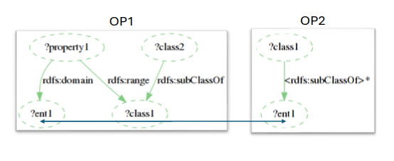
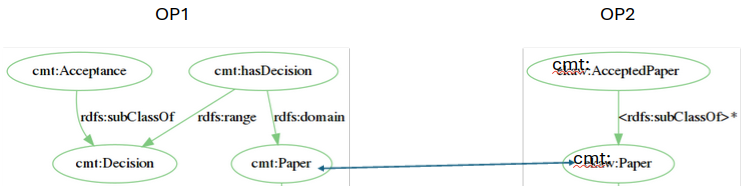
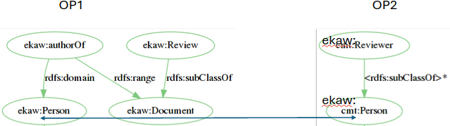

# Experimentation with Transformation Pattern C1

25-06-24 by Ondřej Zamazal

## Transformation Pattern C1



OP1 (source ontology pattern)

```
SELECT DISTINCT ?class1 ?property1 ?class2 ?ent1 
	WHERE { 
		?property1 rdfs:domain ?ent1 .
		?property1 rdfs:range ?class1 .
		?class2 rdfs:subClassOf ?class1 
	} 
```


Naming detection pattern

```
none?
```

OP2 (target ontology pattern)

```
SELECT DISTINCT ?class1 ?ent1

	 WHERE {
	
	 	?class1 rdfs:subClassOf ?ent1
	
	 }
```

Pattern transformation

```
OP1:ent1=OP2:ent2
```

Naming transformation patterns

```
TODO
```

## Applied on cmt.owl

URL: https://oaei.ontologymatching.org/2024/conference/data/cmt.owl

### OP1 detection

```
(Range:?class2=<http://cmt#Paper>);?class1=<http://cmt#Reviewer>;?property1=<http://cmt#readPaper>;?class3=<http://cmt#PaperAbstract>
(Range:?class2=<http://cmt#Paper>);?class1=<http://cmt#Reviewer>;?property1=<http://cmt#readPaper>;?class3=<http://cmt#PaperFullVersion>
(Range:?class2=<http://cmt#Paper>);?class1=<http://cmt#Reviewer>;?property1=<http://cmt#hasBeenAssigned>;?class3=<http://cmt#PaperAbstract>
(Range:?class2=<http://cmt#Paper>);?class1=<http://cmt#Reviewer>;?property1=<http://cmt#hasBeenAssigned>;?class3=<http://cmt#PaperFullVersion>
(Range:?class2=<http://cmt#Review>);?class1=<http://cmt#Reviewer>;?property1=<http://cmt#writeReview>;?class3=<http://cmt#Meta-Review>
(Range:?class2=<http://cmt#Document>);?class1=<http://cmt#Person>;?property1=<http://cmt#hasConflictOfInterest>;?class3=<http://cmt#Review>
(Range:?class2=<http://cmt#Document>);?class1=<http://cmt#Person>;?property1=<http://cmt#hasConflictOfInterest>;?class3=<http://cmt#Paper>
(Range:?class2=<http://cmt#ProgramCommitteeMember>);?class1=<http://cmt#ProgramCommittee>;?property1=<http://cmt#hasProgramCommitteeMember>;?class3=<http://cmt#ProgramCommitteeChair>
(Range:?class2=<http://cmt#Reviewer>);?class1=<http://cmt#Bid>;?property1=<http://cmt#adjustedBy>;?class3=<http://cmt#Meta-Reviewer>
(Range:?class2=<http://cmt#ConferenceMember>);?class1=<http://cmt#Conference>;?property1=<http://cmt#hasConferenceMember>;?class3=<http://cmt#ConferenceChair>
(Range:?class2=<http://cmt#ConferenceMember>);?class1=<http://cmt#Conference>;?property1=<http://cmt#hasConferenceMember>;?class3=<http://cmt#ProgramCommitteeMember>
(Range:?class2=<http://cmt#ConferenceMember>);?class1=<http://cmt#Conference>;?property1=<http://cmt#hasConferenceMember>;?class3=<http://cmt#Author>
(Range:?class2=<http://cmt#ConferenceMember>);?class1=<http://cmt#Conference>;?property1=<http://cmt#hasConferenceMember>;?class3=<http://cmt#Reviewer>
(Range:?class2=<http://cmt#ConferenceMember>);?class1=<http://cmt#Conference>;?property1=<http://cmt#hasConferenceMember>;?class3=<http://cmt#AssociatedChair>
(Range:?class2=<http://cmt#Reviewer>);?class1=<http://cmt#ExternalReviewer>;?property1=<http://cmt#assignedByReviewer>;?class3=<http://cmt#Meta-Reviewer>
(Range:?class2=<http://cmt#Review>);?class1=<http://cmt#ProgramCommitteeChair>;?property1=<http://cmt#endReview>;?class3=<http://cmt#Meta-Review>
(Range:?class2=<http://cmt#Reviewer>);?class1=<http://cmt#Review>;?property1=<http://cmt#writtenBy>;?class3=<http://cmt#Meta-Reviewer>
(Range:?class2=<http://cmt#Decision>);?class1=<http://cmt#Paper>;?property1=<http://cmt#hasDecision>;?class3=<http://cmt#Acceptance>
(Range:?class2=<http://cmt#Decision>);?class1=<http://cmt#Paper>;?property1=<http://cmt#hasDecision>;?class3=<http://cmt#Rejection>
(Range:?class2=<http://cmt#Reviewer>);?class1=<http://cmt#Paper>;?property1=<http://cmt#assignedTo>;?class3=<http://cmt#Meta-Reviewer>
(Range:?class2=<http://cmt#Reviewer>);?class1=<http://cmt#Paper>;?property1=<http://cmt#readByReviewer>;?class3=<http://cmt#Meta-Reviewer>
(Range:?class2=<http://cmt#Author>);?class1=<http://cmt#Paper>;?property1=<http://cmt#hasAuthor>;?class3=<http://cmt#Co-author>
(Range:?class2=<http://cmt#Author>);?class1=<http://cmt#Paper>;?property1=<http://cmt#hasAuthor>;?class3=<http://cmt#AuthorNotReviewer>
(Range:?class2=<http://cmt#Paper>);?class1=<http://cmt#Author>;?property1=<http://cmt#submitPaper>;?class3=<http://cmt#PaperAbstract>
(Range:?class2=<http://cmt#Paper>);?class1=<http://cmt#Author>;?property1=<http://cmt#submitPaper>;?class3=<http://cmt#PaperFullVersion>
(Range:?class2=<http://cmt#Paper>);?class1=<http://cmt#Author>;?property1=<http://cmt#writePaper>;?class3=<http://cmt#PaperAbstract>
(Range:?class2=<http://cmt#Paper>);?class1=<http://cmt#Author>;?property1=<http://cmt#writePaper>;?class3=<http://cmt#PaperFullVersion>
(Range:?class2=<http://cmt#Paper>);?class1=<http://cmt#Co-author>;?property1=<http://cmt#co-writePaper>;?class3=<http://cmt#PaperAbstract>
(Range:?class2=<http://cmt#Paper>);?class1=<http://cmt#Co-author>;?property1=<http://cmt#co-writePaper>;?class3=<http://cmt#PaperFullVersion>
(Range:?class2=<http://cmt#Reviewer>);?class1=<http://cmt#Administrator>;?property1=<http://cmt#assignReviewer>;?class3=<http://cmt#Meta-Reviewer>
(Range:?class2=<http://cmt#Paper>);?class1=<http://cmt#Administrator>;?property1=<http://cmt#rejectPaper>;?class3=<http://cmt#PaperAbstract>
(Range:?class2=<http://cmt#Paper>);?class1=<http://cmt#Administrator>;?property1=<http://cmt#rejectPaper>;?class3=<http://cmt#PaperFullVersion>
(Range:?class2=<http://cmt#ProgramCommitteeMember>);?class1=<http://cmt#Administrator>;?property1=<http://cmt#setMaxPapers>;?class3=<http://cmt#ProgramCommitteeChair>
(Range:?class2=<http://cmt#Paper>);?class1=<http://cmt#Administrator>;?property1=<http://cmt#acceptPaper>;?class3=<http://cmt#PaperAbstract>
(Range:?class2=<http://cmt#Paper>);?class1=<http://cmt#Administrator>;?property1=<http://cmt#acceptPaper>;?class3=<http://cmt#PaperFullVersion>
(Range:?class2=<http://cmt#ProgramCommitteeMember>);?class1=<http://cmt#Administrator>;?property1=<http://cmt#addProgramCommitteeMember>;?class3=<http://cmt#ProgramCommitteeChair>
(Range:?class2=<http://cmt#Paper>);?class1=_:N56777848ec4c4bc9b17269d79dedeef2;?property1=<http://cmt#markConflictOfInterest>;?class3=<http://cmt#PaperAbstract>
(Range:?class2=<http://cmt#Paper>);?class1=_:N56777848ec4c4bc9b17269d79dedeef2;?property1=<http://cmt#markConflictOfInterest>;?class3=<http://cmt#PaperFullVersion>
```


### Detection and transformation Examples



### New axioms

```
cmt#Accepted_Paper SubClassOf cmt#Paper​

cmt#Accepted_Paper EquivalentTo cmt#Paper and (cmt#hasDecision some cmt#Acceptance)
```

## Applied on ekaw.owl

URL: https://oaei.ontologymatching.org/2024/conference/data/ekaw.owl

### OP1 detection

```
(Range:?class2=<http://ekaw#Event>);?class1=<http://ekaw#Event>;?property1=<http://ekaw#partOfEvent>;?class3=<http://ekaw#Scientific_Event>
(Range:?class2=<http://ekaw#Event>);?class1=<http://ekaw#Event>;?property1=<http://ekaw#partOfEvent>;?class3=<http://ekaw#Social_Event>
(Range:?class2=<http://ekaw#Event>);?class1=<http://ekaw#Event>;?property1=<http://ekaw#hasEvent>;?class3=<http://ekaw#Scientific_Event>
(Range:?class2=<http://ekaw#Event>);?class1=<http://ekaw#Event>;?property1=<http://ekaw#hasEvent>;?class3=<http://ekaw#Social_Event>
(Range:?class2=<http://ekaw#Document>);?class1=<http://ekaw#Person>;?property1=<http://ekaw#authorOf>;?class3=<http://ekaw#Abstract>
(Range:?class2=<http://ekaw#Document>);?class1=<http://ekaw#Person>;?property1=<http://ekaw#authorOf>;?class3=<http://ekaw#Review>
(Range:?class2=<http://ekaw#Document>);?class1=<http://ekaw#Person>;?property1=<http://ekaw#authorOf>;?class3=<http://ekaw#Multi-author_Volume>
(Range:?class2=<http://ekaw#Document>);?class1=<http://ekaw#Person>;?property1=<http://ekaw#authorOf>;?class3=<http://ekaw#Web_Site>
(Range:?class2=<http://ekaw#Document>);?class1=<http://ekaw#Person>;?property1=<http://ekaw#authorOf>;?class3=<http://ekaw#Programme_Brochure>
(Range:?class2=<http://ekaw#Document>);?class1=<http://ekaw#Person>;?property1=<http://ekaw#authorOf>;?class3=<http://ekaw#Flyer>
(Range:?class2=<http://ekaw#Document>);?class1=<http://ekaw#Person>;?property1=<http://ekaw#authorOf>;?class3=<http://ekaw#Paper>
(Range:?class2=<http://ekaw#Review>);?class1=<http://ekaw#Paper>;?property1=<http://ekaw#hasReview>;?class3=<http://ekaw#Positive_Review>
(Range:?class2=<http://ekaw#Review>);?class1=<http://ekaw#Paper>;?property1=<http://ekaw#hasReview>;?class3=<http://ekaw#Neutral_Review>
(Range:?class2=<http://ekaw#Review>);?class1=<http://ekaw#Paper>;?property1=<http://ekaw#hasReview>;?class3=<http://ekaw#Negative_Review>
(Range:?class2=<http://ekaw#Possible_Reviewer>);?class1=<http://ekaw#Paper>;?property1=<http://ekaw#hasReviewer>;?class3=<http://ekaw#PC_Member>
(Range:?class2=<http://ekaw#Person>);?class1=<http://ekaw#Document>;?property1=<http://ekaw#writtenBy>;?class3=<http://ekaw#Paper_Author>
(Range:?class2=<http://ekaw#Person>);?class1=<http://ekaw#Document>;?property1=<http://ekaw#writtenBy>;?class3=<http://ekaw#Agency_Staff_Member>
(Range:?class2=<http://ekaw#Person>);?class1=<http://ekaw#Document>;?property1=<http://ekaw#writtenBy>;?class3=<http://ekaw#Conference_Participant>
(Range:?class2=<http://ekaw#Person>);?class1=<http://ekaw#Document>;?property1=<http://ekaw#writtenBy>;?class3=<http://ekaw#Possible_Reviewer>
(Range:?class2=<http://ekaw#Person>);?class1=<http://ekaw#Document>;?property1=<http://ekaw#writtenBy>;?class3=<http://ekaw#Student>
(Range:?class2=<http://ekaw#Document>);?class1=<http://ekaw#Document>;?property1=<http://ekaw#hasUpdatedVersion>;?class3=<http://ekaw#Abstract>
(Range:?class2=<http://ekaw#Document>);?class1=<http://ekaw#Document>;?property1=<http://ekaw#hasUpdatedVersion>;?class3=<http://ekaw#Review>
(Range:?class2=<http://ekaw#Document>);?class1=<http://ekaw#Document>;?property1=<http://ekaw#hasUpdatedVersion>;?class3=<http://ekaw#Multi-author_Volume>
(Range:?class2=<http://ekaw#Document>);?class1=<http://ekaw#Document>;?property1=<http://ekaw#hasUpdatedVersion>;?class3=<http://ekaw#Web_Site>
(Range:?class2=<http://ekaw#Document>);?class1=<http://ekaw#Document>;?property1=<http://ekaw#hasUpdatedVersion>;?class3=<http://ekaw#Programme_Brochure>
(Range:?class2=<http://ekaw#Document>);?class1=<http://ekaw#Document>;?property1=<http://ekaw#hasUpdatedVersion>;?class3=<http://ekaw#Flyer>
(Range:?class2=<http://ekaw#Document>);?class1=<http://ekaw#Document>;?property1=<http://ekaw#hasUpdatedVersion>;?class3=<http://ekaw#Paper>
(Range:?class2=<http://ekaw#Document>);?class1=<http://ekaw#Document>;?property1=<http://ekaw#updatedVersionOf>;?class3=<http://ekaw#Abstract>
(Range:?class2=<http://ekaw#Document>);?class1=<http://ekaw#Document>;?property1=<http://ekaw#updatedVersionOf>;?class3=<http://ekaw#Review>
(Range:?class2=<http://ekaw#Document>);?class1=<http://ekaw#Document>;?property1=<http://ekaw#updatedVersionOf>;?class3=<http://ekaw#Multi-author_Volume>
(Range:?class2=<http://ekaw#Document>);?class1=<http://ekaw#Document>;?property1=<http://ekaw#updatedVersionOf>;?class3=<http://ekaw#Web_Site>
(Range:?class2=<http://ekaw#Document>);?class1=<http://ekaw#Document>;?property1=<http://ekaw#updatedVersionOf>;?class3=<http://ekaw#Programme_Brochure>
(Range:?class2=<http://ekaw#Document>);?class1=<http://ekaw#Document>;?property1=<http://ekaw#updatedVersionOf>;?class3=<http://ekaw#Flyer>
(Range:?class2=<http://ekaw#Document>);?class1=<http://ekaw#Document>;?property1=<http://ekaw#updatedVersionOf>;?class3=<http://ekaw#Paper>
(Range:?class2=<http://ekaw#Paper>);?class1=<http://ekaw#Review>;?property1=<http://ekaw#reviewOfPaper>;?class3=<http://ekaw#Workshop_Paper>
(Range:?class2=<http://ekaw#Paper>);?class1=<http://ekaw#Review>;?property1=<http://ekaw#reviewOfPaper>;?class3=<http://ekaw#Camera_Ready_Paper>
(Range:?class2=<http://ekaw#Paper>);?class1=<http://ekaw#Review>;?property1=<http://ekaw#reviewOfPaper>;?class3=<http://ekaw#Conference_Paper>
(Range:?class2=<http://ekaw#Paper>);?class1=<http://ekaw#Review>;?property1=<http://ekaw#reviewOfPaper>;?class3=<http://ekaw#Industrial_Paper>
(Range:?class2=<http://ekaw#Paper>);?class1=<http://ekaw#Review>;?property1=<http://ekaw#reviewOfPaper>;?class3=<http://ekaw#Regular_Paper>
(Range:?class2=<http://ekaw#Paper>);?class1=<http://ekaw#Review>;?property1=<http://ekaw#reviewOfPaper>;?class3=<http://ekaw#Submitted_Paper>
(Range:?class2=<http://ekaw#Paper>);?class1=<http://ekaw#Review>;?property1=<http://ekaw#reviewOfPaper>;?class3=<http://ekaw#Poster_Paper>
(Range:?class2=<http://ekaw#Paper>);?class1=<http://ekaw#Review>;?property1=<http://ekaw#reviewOfPaper>;?class3=<http://ekaw#Demo_Paper>
(Range:?class2=<http://ekaw#Possible_Reviewer>);?class1=<http://ekaw#Review>;?property1=<http://ekaw#reviewWrittenBy>;?class3=<http://ekaw#PC_Member>
(Range:?class2=<http://ekaw#Event>);?class1=<http://ekaw#Location>;?property1=<http://ekaw#locationOf>;?class3=<http://ekaw#Scientific_Event>
(Range:?class2=<http://ekaw#Event>);?class1=<http://ekaw#Location>;?property1=<http://ekaw#locationOf>;?class3=<http://ekaw#Social_Event>
(Range:?class2=<http://ekaw#Paper>);?class1=<http://ekaw#Possible_Reviewer>;?property1=<http://ekaw#reviewerOfPaper>;?class3=<http://ekaw#Workshop_Paper>
(Range:?class2=<http://ekaw#Paper>);?class1=<http://ekaw#Possible_Reviewer>;?property1=<http://ekaw#reviewerOfPaper>;?class3=<http://ekaw#Camera_Ready_Paper>
(Range:?class2=<http://ekaw#Paper>);?class1=<http://ekaw#Possible_Reviewer>;?property1=<http://ekaw#reviewerOfPaper>;?class3=<http://ekaw#Conference_Paper>
(Range:?class2=<http://ekaw#Paper>);?class1=<http://ekaw#Possible_Reviewer>;?property1=<http://ekaw#reviewerOfPaper>;?class3=<http://ekaw#Industrial_Paper>
(Range:?class2=<http://ekaw#Paper>);?class1=<http://ekaw#Possible_Reviewer>;?property1=<http://ekaw#reviewerOfPaper>;?class3=<http://ekaw#Regular_Paper>
(Range:?class2=<http://ekaw#Paper>);?class1=<http://ekaw#Possible_Reviewer>;?property1=<http://ekaw#reviewerOfPaper>;?class3=<http://ekaw#Submitted_Paper>
(Range:?class2=<http://ekaw#Paper>);?class1=<http://ekaw#Possible_Reviewer>;?property1=<http://ekaw#reviewerOfPaper>;?class3=<http://ekaw#Poster_Paper>
(Range:?class2=<http://ekaw#Paper>);?class1=<http://ekaw#Possible_Reviewer>;?property1=<http://ekaw#reviewerOfPaper>;?class3=<http://ekaw#Demo_Paper>
(Range:?class2=<http://ekaw#Event>);?class1=_:N18f198cdbac44a6783486661450c42fc;?property1=<http://ekaw#listsEvent>;?class3=<http://ekaw#Scientific_Event>
(Range:?class2=<http://ekaw#Event>);?class1=_:N18f198cdbac44a6783486661450c42fc;?property1=<http://ekaw#listsEvent>;?class3=<http://ekaw#Social_Event>
(Range:?class2=<http://ekaw#Individual_Presentation>);?class1=_:N354cc055682e483799572419b7bf13b9;?property1=<http://ekaw#paperPresentedAs>;?class3=<http://ekaw#Invited_Talk>
(Range:?class2=<http://ekaw#Individual_Presentation>);?class1=_:N354cc055682e483799572419b7bf13b9;?property1=<http://ekaw#paperPresentedAs>;?class3=<http://ekaw#Contributed_Talk>
(Range:?class2=<http://ekaw#Individual_Presentation>);?class1=_:N354cc055682e483799572419b7bf13b9;?property1=<http://ekaw#paperPresentedAs>;?class3=<http://ekaw#Tutorial>
(Range:?class2=<http://ekaw#Event>);?class1=_:Nee2ceec053a94684abbe97e639fdc105;?property1=<http://ekaw#organises>;?class3=<http://ekaw#Scientific_Event>
(Range:?class2=<http://ekaw#Event>);?class1=_:Nee2ceec053a94684abbe97e639fdc105;?property1=<http://ekaw#organises>;?class3=<http://ekaw#Social_Event>
````

### Detection and transformation Examples



### New axioms

```
ekaw#Reviewer SubClassOf ekaw#Person​

ekaw#Reviewer EquivalentTo ekaw#Person and (ekaw#authorOf some ekaw#Review)
```

**Onto-DESIDE ontologies**

## Applied on AMONTOLOGY.owl

URL: http://rest.matportal.org/ontologies/AMONTOLOGY/submissions/1/download?apikey=66c82e77-ce0d-4385-8056-a95898e47ebb

### OP1 detection

none

<!-- ### Detection and transformation

### New axioms -->

## Applied on BCAO.owl

URL: https://raw.githubusercontent.com/linmor-sys/BCAO/main/BCAO.owl

### OP1 detection

```
(Range:?class2=<https://github.com/linmor-sys/BCAO.owl#Connection>);?class1=<https://github.com/linmor-sys/BCAO.owl#Product>;?property1=<https://github.com/linmor-sys/BCAO.owl#has_connection>;?class3=<https://github.com/linmor-sys/BCAO.owl#Accessory_External>
(Range:?class2=<https://github.com/linmor-sys/BCAO.owl#Connection>);?class1=<https://github.com/linmor-sys/BCAO.owl#Product>;?property1=<https://github.com/linmor-sys/BCAO.owl#has_connection>;?class3=<https://github.com/linmor-sys/BCAO.owl#Accessory_Internal>
(Range:?class2=<https://github.com/linmor-sys/BCAO.owl#Connection>);?class1=<https://github.com/linmor-sys/BCAO.owl#Product>;?property1=<https://github.com/linmor-sys/BCAO.owl#has_connection>;?class3=<https://github.com/linmor-sys/BCAO.owl#Direct_Chemical>
(Range:?class2=<https://github.com/linmor-sys/BCAO.owl#Connection>);?class1=<https://github.com/linmor-sys/BCAO.owl#Product>;?property1=<https://github.com/linmor-sys/BCAO.owl#has_connection>;?class3=<https://github.com/linmor-sys/BCAO.owl#Direct_Integral>
(Range:?class2=<https://github.com/linmor-sys/BCAO.owl#Connection>);?class1=<https://github.com/linmor-sys/BCAO.owl#Product>;?property1=<https://github.com/linmor-sys/BCAO.owl#has_connection>;?class3=<https://github.com/linmor-sys/BCAO.owl#Direct_Integral_With_Inserts>
(Range:?class2=<https://github.com/linmor-sys/BCAO.owl#Connection>);?class1=<https://github.com/linmor-sys/BCAO.owl#Product>;?property1=<https://github.com/linmor-sys/BCAO.owl#has_connection>;?class3=<https://github.com/linmor-sys/BCAO.owl#Direct_With_Additional_Fixing_Devices>
(Range:?class2=<https://github.com/linmor-sys/BCAO.owl#Connection>);?class1=<https://github.com/linmor-sys/BCAO.owl#Product>;?property1=<https://github.com/linmor-sys/BCAO.owl#has_connection>;?class3=<https://github.com/linmor-sys/BCAO.owl#Filled_With_Hard_Chemical>
(Range:?class2=<https://github.com/linmor-sys/BCAO.owl#Connection>);?class1=<https://github.com/linmor-sys/BCAO.owl#Product>;?property1=<https://github.com/linmor-sys/BCAO.owl#has_connection>;?class3=<https://github.com/linmor-sys/BCAO.owl#Filled_With_Soft_Chemical>
(Range:?class2=<https://github.com/linmor-sys/BCAO.owl#Edge_Geometry>);?class1=<https://github.com/linmor-sys/BCAO.owl#Product>;?property1=<https://github.com/linmor-sys/BCAO.owl#has_edge_geometry>;?class3=<https://github.com/linmor-sys/BCAO.owl#Open_Linear>
(Range:?class2=<https://github.com/linmor-sys/BCAO.owl#Edge_Geometry>);?class1=<https://github.com/linmor-sys/BCAO.owl#Product>;?property1=<https://github.com/linmor-sys/BCAO.owl#has_edge_geometry>;?class3=<https://github.com/linmor-sys/BCAO.owl#Overlapping_On_One_Side>
(Range:?class2=<https://github.com/linmor-sys/BCAO.owl#Edge_Geometry>);?class1=<https://github.com/linmor-sys/BCAO.owl#Product>;?property1=<https://github.com/linmor-sys/BCAO.owl#has_edge_geometry>;?class3=<https://github.com/linmor-sys/BCAO.owl#Symmetrical_Overlapping>
(Range:?class2=<https://github.com/linmor-sys/BCAO.owl#Edge_Geometry>);?class1=<https://github.com/linmor-sys/BCAO.owl#Product>;?property1=<https://github.com/linmor-sys/BCAO.owl#has_edge_geometry>;?class3=<https://github.com/linmor-sys/BCAO.owl#Unsymmetrical_Overlapping>
(Range:?class2=<https://github.com/linmor-sys/BCAO.owl#Edge_Geometry>);?class1=<https://github.com/linmor-sys/BCAO.owl#Product>;?property1=<https://github.com/linmor-sys/BCAO.owl#has_edge_geometry>;?class3=<https://github.com/linmor-sys/BCAO.owl#With_Insert_On_One_Side>
(Range:?class2=<https://github.com/linmor-sys/BCAO.owl#Edge_Geometry>);?class1=<https://github.com/linmor-sys/BCAO.owl#Product>;?property1=<https://github.com/linmor-sys/BCAO.owl#has_edge_geometry>;?class3=<https://github.com/linmor-sys/BCAO.owl#With_Insert_On_Two_Sides>
(Range:?class2=<https://github.com/linmor-sys/BCAO.owl#Edge_Standardisation>);?class1=<https://github.com/linmor-sys/BCAO.owl#Product>;?property1=<https://github.com/linmor-sys/BCAO.owl#has_edge_standardisation>;?class3=<https://github.com/linmor-sys/BCAO.owl#Half_Standardised>
(Range:?class2=<https://github.com/linmor-sys/BCAO.owl#Edge_Standardisation>);?class1=<https://github.com/linmor-sys/BCAO.owl#Product>;?property1=<https://github.com/linmor-sys/BCAO.owl#has_edge_standardisation>;?class3=<https://github.com/linmor-sys/BCAO.owl#Made_On_Site>
(Range:?class2=<https://github.com/linmor-sys/BCAO.owl#Edge_Standardisation>);?class1=<https://github.com/linmor-sys/BCAO.owl#Product>;?property1=<https://github.com/linmor-sys/BCAO.owl#has_edge_standardisation>;?class3=<https://github.com/linmor-sys/BCAO.owl#Pre-made>
(Range:?class2=<https://github.com/linmor-sys/BCAO.owl#Fixing_Factors>);?class1=<https://github.com/linmor-sys/BCAO.owl#Product>;?property1=<https://github.com/linmor-sys/BCAO.owl#has_fixing>;?class3=<https://github.com/linmor-sys/BCAO.owl#Accessible>
(Range:?class2=<https://github.com/linmor-sys/BCAO.owl#Fixing_Factors>);?class1=<https://github.com/linmor-sys/BCAO.owl#Product>;?property1=<https://github.com/linmor-sys/BCAO.owl#has_fixing>;?class3=<https://github.com/linmor-sys/BCAO.owl#Accessible_With_Causing_Damage>
(Range:?class2=<https://github.com/linmor-sys/BCAO.owl#Fixing_Factors>);?class1=<https://github.com/linmor-sys/BCAO.owl#Product>;?property1=<https://github.com/linmor-sys/BCAO.owl#has_fixing>;?class3=<https://github.com/linmor-sys/BCAO.owl#Accessible_With_Causing_No_Damage>
(Range:?class2=<https://github.com/linmor-sys/BCAO.owl#Fixing_Factors>);?class1=<https://github.com/linmor-sys/BCAO.owl#Product>;?property1=<https://github.com/linmor-sys/BCAO.owl#has_fixing>;?class3=<https://github.com/linmor-sys/BCAO.owl#Accessible_With_Causing_Repairable_Damage>
(Range:?class2=<https://github.com/linmor-sys/BCAO.owl#Fixing_Factors>);?class1=<https://github.com/linmor-sys/BCAO.owl#Product>;?property1=<https://github.com/linmor-sys/BCAO.owl#has_fixing>;?class3=<https://github.com/linmor-sys/BCAO.owl#Not_Accessible>
(Range:?class2=<https://github.com/linmor-sys/BCAO.owl#Morphology_Of_Joints>);?class1=<https://github.com/linmor-sys/BCAO.owl#Product>;?property1=<https://github.com/linmor-sys/BCAO.owl#has_joint_morphology>;?class3=<https://github.com/linmor-sys/BCAO.owl#Knot>
(Range:?class2=<https://github.com/linmor-sys/BCAO.owl#Morphology_Of_Joints>);?class1=<https://github.com/linmor-sys/BCAO.owl#Product>;?property1=<https://github.com/linmor-sys/BCAO.owl#has_joint_morphology>;?class3=<https://github.com/linmor-sys/BCAO.owl#Linear>
(Range:?class2=<https://github.com/linmor-sys/BCAO.owl#Morphology_Of_Joints>);?class1=<https://github.com/linmor-sys/BCAO.owl#Product>;?property1=<https://github.com/linmor-sys/BCAO.owl#has_joint_morphology>;?class3=<https://github.com/linmor-sys/BCAO.owl#Point>
(Range:?class2=<https://github.com/linmor-sys/BCAO.owl#Morphology_Of_Joints>);?class1=<https://github.com/linmor-sys/BCAO.owl#Product>;?property1=<https://github.com/linmor-sys/BCAO.owl#has_joint_morphology>;?class3=<https://github.com/linmor-sys/BCAO.owl#Service>
```

### Detection and transformation Examples

TODO

### New axioms

TODO

## Applied on TODO

URL: 

### OP1 detection

### Detection and transformation Examples

### New axioms
